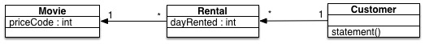

Refactoring
===========

Exemple de refactoring en python. Celui-ci est issue du livre 'Refactoring' de Martin Fowler.

Description du programme :
--------------------------
Le programme calcule et affiche la fiche des client d'un magasin de location de vidéo.
Il calcule les charges qui dépendent du temps de location ainsi que du type de film. Ceux-ci sont au nombre de 3 avec les films: 
* pour Enfant, 
* les nouveautés
* les standards. 

Programme Existant :
--------------------

